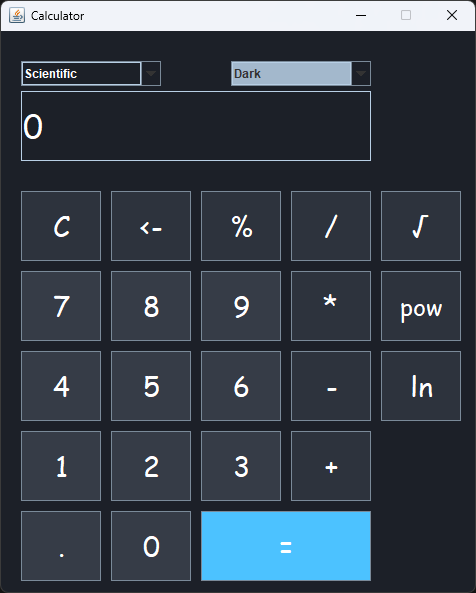
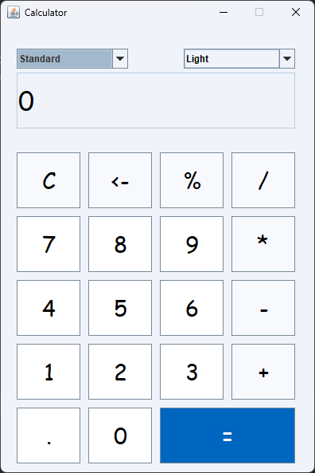

# Java Swing Calculator

A desktop calculator application developed using Java Swing and Maven.

## Technologies Used
- Java
- Java Swing
- Maven

## Features
- Standard Calculator
- Scientific Calculator
- Dark/Light Theme
- Responsive UI

## Screenshots

| Scientific / Dark | Standard / Light |
|-------------------|------------------|
|  |  |

## Requirements
- Java 11 or higher

## Installation

git clone https://github.com/anuj-codess/java-swing-calculator.git

## Developed By
Anuj Sharma
